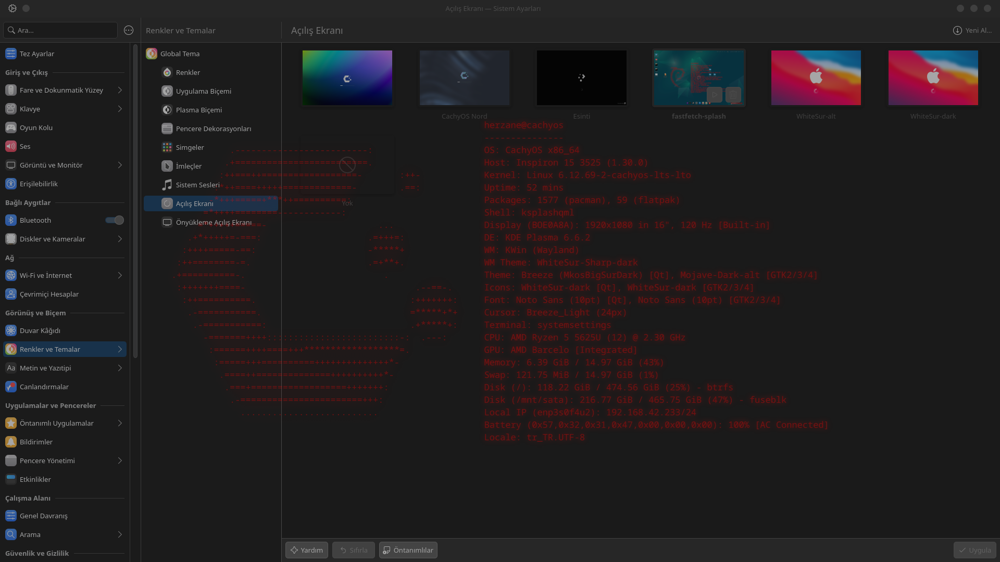

<h1 align="center">Fastfetch KDE Splash v1.5</h1>

<p align="center">
  
</p>

<div align="center">
  <table>
    <tr>
      <td width="50%">
        
      </td>
      <td width="50%">
        
      </td>
    </tr>
  </table>
</div>

<p align="center">
  KDE Plasma için <code>fastfetch</code> ile "hacker/matrix" tarzında açılış animasyonu.
</p>

<p align="center">
  <strong><a href="README.md">English</a></strong> | <strong><a href="README.tr.md">Türkçe</a></strong>
</p>

<p align="center">
  <a href="https://kde.org/plasma-desktop/"></a>
  <a href="https://doc.qt.io/qt-6/qmlapplications.html"></a>
  <a href="https://www.gnu.org/software/bash/"></a>
  <a href="https://github.com/fastfetch-cli/fastfetch"></a>
</p>

### 🌟 Özellikler

*   **Renk Seçimi:** İstediğiniz her tema rengini serbestçe seçebilirsiniz.
*   **Logo & Bilgi Düzenleri:** Sadece logo veya tüm detayların yer aldığı "full" mod arasından seçim yapabilirsiniz.
*   **Arka Plan Ayarları:** Arka plan rengini belirleyebilir veya şeffaf olarak ayarlayabilirsiniz.
*   **Ayarlanabilir Animasyon Hızları (v1.5):** Kurulum sırasında Normal, Hızlı ve Yavaş hız seçenekleri eklendi.

### 📋 Gereksinimler

*   **KDE Plasma:** 5 veya 6 sürümü.
*   **Fastfetch:** Sisteminizde kurulu olmalıdır.
*   **Qt5Compat.GraphicalEffects:** Görsel efektler için gereklidir.

## 🛠️ Kurulum ve Yapılandırma

### 1. Kurulum Betiği ile (Önerilen)

`install.sh` betiği tüm işlemleri otomatikleştirir:
*   Tercihlerinizi (renk, düzen, arka plan) sorar.
*   Dosyaları doğru dizine (`~/.local/share/plasma/look-and-feel/fastfetch-splash`) kopyalar.
*   Yapılandırmayı otomatik olarak tamamlar.

```bash
#depoyu klonlamak için
git clone https://github.com/herzane52/fastfetch-kde-splash.git
cd fastfetch-kde-splash
```

```bash
#kurulum betiğine çalıştırma izni vermek için
chmod +x install.sh
```
```bash
#kurulum betiğini çalıştırmak için
./install.sh
```

### 2. Manuel (Elle) Yapılandırma (Mağaza Kullanıcıları)

Eğer temayı KDE Store üzerinden kurduysanız, "Configuration Required" hatasıyla karşılaşırsınız. Bunu düzeltmek için şu dosyayı (`~/.local/share/plasma/look-and-feel/fastfetch-splash/contents/splash/Splash.qml`) (10-13. satırlar arası) elle düzenleyebilirsiniz:

```bash
nano ~/.local/share/plasma/look-and-feel/fastfetch-splash/contents/splash/Splash.qml
```

*   `Splash.qml` dosyasını açın.
*   `property bool isConfigured` değerini `true` yapın.
*   `themeColor`, `displayMode`, `bgColor` ve **Animasyon Hızı** ayarlarını (`glitchInterval`, `introDuration` vb.) isteğinize göre özelleştirin. Dosya içerisindeki tüm ayarlar açıklamalarla belgelenmiştir.

### 🚀 Kullanım

1.  **Sistem Ayarları**'nı açın.
2.  **Görünüm > Açılış Ekranı** sekmesine gidin.
3.  Listeden **fastfetch-splash** öğesini seçin ve **Uygula**'ya tıklayın.

## Geliştirme ve Hızlı Test

Projeyi hızlıca test etmek için `ksplashqml` aracını kullanabilirsiniz. Proje dizinindeyken:

```bash
#dizinin doğru olduğuna emin olun
ksplashqml /home/fastfetch-kde-splash 
```

> **Not:** Test etmeden önce `Splash.qml` içindeki `isConfigured` değerini `true` yapmayı unutmayın.

## 🛠️ Hata Çözümleri

*   **"Configuration Required" Hatası:** Temayı script (`install.sh`) kullanmadan kurduğunuzda bu uyarıyı alırsınız. Çözüm için `install.sh` betiğini çalıştırın veya `Splash.qml` dosyasındaki `isConfigured` değerini `true` yapın.
*   **"'fastfetch' not found" Hatası:** Sisteminizde `fastfetch` yüklü değildir. Dağıtımınızın paket yöneticisini kullanarak (`sudo pacman -S fastfetch` veya `sudo apt install fastfetch` gibi) yükleme yapın.
*   **"'fastfetch' returned empty output" Hatası:** Komut çalışıyor ancak çıktı veremiyor. Uçbirimde `fastfetch` komutunun normal çalıştığından emin olun.
*   **Görsel Hatalar/Eksiklikler:** Eğer efektler (neon parlama, glitch vb.) görünmüyorsa `Qt5Compat.GraphicalEffects` paketinin kurulu olduğundan emin olun.

<div align="center">

## [MIT](LICENSE) lisansı altında yayınlanmaktadır.

</div>
